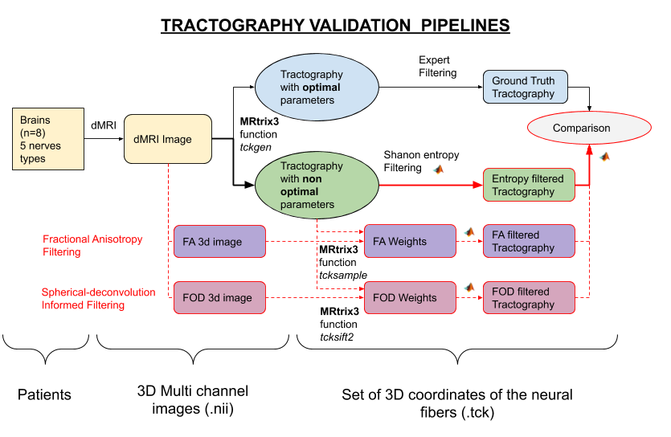

# Tractography filtering quality : comparison between state of art (FA and FOD) and newly developed entropy-based methods

## Table of contents

  - [Introduction](#introduction)
    - [Context](#context)
    - [Input data](#input-data)
  - [Tractography Filtering Validation Pipeline](#tractography-filtering-validation-pipeline)
    - [Computing tracks weights](#computing-tracks-weights)
    - [Evaluation](#evaluation)
    - [Dice curve](#dice-curve)
    - [Tracks visualization](#tracks-visualization)
  - [Methods Comparison](#methods-comparison)
    - [Brute results](#brute-results)
    - [Significativness](#significativness)
    - [Linear model](#linear-model)
    - [Opimal threshold variation](#opimal-threshold-variation)
  - [Conclusion](#conclusion)
- [Folders description](#folders-description)
    - [Data](#data)
    - [Code](#code)
    - [Table_results](#table_results)
    - [Examples](#examples)
    - [Img](#img)


## Introduction

### Context

This code provides tools for the evaluation of tractography filtering. The entropy-based method has been developed by Méghane DECROOCQ and available on [this repository](https://github.com/megdec/tractography-visualization).

Our objective is to compare the quality of the entropy-based method with the method usually used in tractography filtering, Fractional Anisotropy (FA) and Fiber Orientation Distributions (FOD).

We did this comparison with the following tractography validation pipelines, using MRtrix3 and MATLAB. We then performed a statistical analysis with R.





### Input data

For this comparison, all the data are available in the data directory. We have data for 8 patients (code composed of two letters and three numbers). For each patient, we study 9 nerves : III, V, NF and NF are separated in two parts (example : IIID for right hemisphere, IIIG for left hemisphere).

| Nerve definition | Optic          | Oculomotor          | Trigeminal          | Facial and Vestibulocochlear          | Mixte          |
| ------------------ | ------------- | -------------------- | ------------------ | --------------------------------------- | ------------- |
| Nerve abbreviation | Chiasma | III                         | V                        | NF                                                   | NM              |
| Diameter (mm)  | 10                | 5                          | 7                         | 3                                                     | 2                  |

A few nerve are not available. In table X are presented the available nerves for each patient.

|                     | AS012          | BF009          | BM013          | CE008          | GF006          | MG007          | MV011          | SF010          |
| -------------- | -------------- | -------------- | -------------- | -------------- | -------------- | -------------- | -------------- | -------------- |
| Chiasma       | V                 | V                   | V                   | V                   | V                  | V                    | V                   |                       |
| IIID                | V                 | V                   | V                   | V                   | V                  | V                    | V                   | V                    |
| IIIG                | V                 | V                   | V                   | V                   | V                  | V                    | V                   | V                    |
| NFD              | V                 | V                   | V                   | V                   | V                  | V                    | V                   | V                    |
| NFG              | V                 | V                   | V                   | V                   | V                  | V                    | V                   | V                    |
| NMD             | V                 | V                   | V                   | V                   | V                  | V                    | V                   | V                    |
| NMG            | V                 | V                   | V                   |                       | V                  | V                    | V                   | V                    |
| VD                | V                 | V                   | V                   | V                   | V                  | V                    | V                   | V                    |
| VG                | V                 | V                   | V                   | V                   | V                  | V                    | V                   | V                    |


For each patient, we have :

- fa.mif (or fa.nii), a 3D-image containing the fractional anisotropy of the fibre
- fod.mif (of fod.nii), a 3D-image containing the spherical harmonics of the fibre orientation distributions
- eddy_corrected_dti.mif, a 3D-image corresponding to the result of the diffusion MRI
- for each nerve :
    - Ground_Truth.tck and Ground_Truth_vox.tck, corresponding to tracks files realised by the expert with the optimal parameters, respectively in millimeters and voxels. We will use it as ground truth for the evaluation
    - for each parameter and each condition of this parameter, Tracks.tck and Tracks_vox.tck, corresponding to tracks files realised with the non-optimal parameters, respectively in millimeters and voxels. (table X)

| Parameters                       | Value 1          | Value 2          | Value 3          | Value 4          | Value 5          |
| ----------------------------- | -------------- | -------------- | --------------- | ---------------- | --------------- |
| FA threshold                     | oFA               | oFA-0.03      | oFA-0.06       | oFA-0.1           | -                    |
| ROI size                            | oROIs           | oROIs+D/5   | oROIs+2D/5  | oROIs+3D/5   | oROIs+4D/5  |
| ROI vertical translation     | oROIl-2D/5   | oROIl-D/5     | oROIl            | oROIl+D/5       | oROIl+2D/5  |
| ROI horizontal translation | oROIl-2D/5   | oROIl-D/5     | oROIl            | oROIl+D/5       | oROIl+2D/5  |


## Tractography Filtering Validation Pipeline

### Computing tracks weights

In the code/Python directory, the scripts tcksample.py and tcksift2.py are made to compute the tracks weights.

For each track file (.tck), tcksample (with the option -stat_tck mean) assigns to each track the mean value of fractional anisotropy (FA map provided) corresponding to the voxel crossed by the track.

For each track file (.tck), tcksift2 assigns to each track a value of weight, according to the FOD map provided.

The weight files are .txt files with a scalar value (mainly a bit above 0) for each track. For both FA and FOD, a high value is associated with a track to remove. For each patient, nerve, parameter and condition of this paramater, we already computed the weights txt files, provided as FA_Weights.txt and FOD_Weights.txt.

For our following filtering approach, we will filter our tracks in an ascendant order. Considering that the lower weight stand for the best tracks. While this make sense for both Entropy and FOD methods, on of our findings is that this is also the better approach for FA methods, as  fibers with higher FA seems to not belong to the nerves in most of the cases.


### Evaluation

With the weights previously computed, we can sort the initial tracks and remove the less relevants. For both FA_Weights.txt and FOD_Weights.txt, we sort the weights in decreasing order. We consider that the less relevant tracks have a high weight.

In the code/Matlab directory, the ***filtering_evaluation.m** scripts compute the dice between a track file and the ground truth. We initially compute the dice between the initial track file and the ground truth. Then, we remove 1% of the less relevant tracks and recompute the dice. Again, we remove the next 1% of less relevant tracks and recompute the dice. We repete the operation until the removal of all tracks. We save the 100 dice values in the csv files Dice_FA_Filltering.csv and Dice_FOD_Filltering.csv.


### Dice curve

In the code/Python directory, the script plot_dice.py plots the evolution of the dice value for all patients, given in parameter the filter_type (FA or FOD), the nerve, the parameter and the condition on the parameter. Here is an example with the nerve IIIG, the parameter FA, and a value of 0.2. 


To make a comparison between all filtering methods and evaluate their filtering potential, we only kept the best dice value for each case, **SD_Max**. 


### Tracks visualization

In the code/Matlab directory, the script Visualisation.m enables to generate track files from weights previously calculated. The scripts takes as inputs :
- Tracks_filename, the initial .tck file with all the tracks generated with non-optimal parameters
- Weights_filename, which is FA_Weights.txt or FOD_Weights.txt, the weights calculated before.
- Output_Dir, which is where the output files will be saved.

As ouput, we save, for each percentage of tracks remaining (default 20, 40, 60, 80 and 100), a .tck file with the X% most relevant tracks (track_X.tck) and their corresponding weights in a .txt file (track_X_weight.txt).

To visualise the tracks in Mrtrix, run the following commands in the correct directory :
```bash
mrview -load fa.nii -tractography.load Tracks.tck --tractography.tsf_load FA_Weights.txt &

mrview -load fa.nii -tractography.load Ground_Truth.tck -tractography.load FA/track_20.tck -tractography.load FA/track_40.tck -tractography.load FA/track_60.tck -tractography.load FA/track_80.tck -tractography.load FA/track_100.tck -tractography.slab -1 -tractography.lighting 1 &
```

Here is an example of visualisation for the patient MG007, Chiasma nerve, paramater FA and condition fa_0.2.


## Methods Comparison

The detail of method comparison can be found on in the [folowing R script](code/R/Comparing_methodes.Rmd)

For all 1312 tracks file (all patients, nerves, parameters and conditions), we looked at the SDmax value which are indicators of the filtering performance potential, and at the optimal threshold values which are indicators of the methods robustness

### Brute results

| Filtering Methods        | Random  | Entropy | FA      | FOD   |
| ------------------------ | ------- | ------- | ------- | ----- |
| **Mean of SDmax**       | 0.718   | 0.785   | 0.790   | 0.805 |
| **Median of SDmax**      | 0.783   | 0.869   | 0.857   | 0.891 |
| **Variance  of SDmax**   | 0.057   | 0.051   | 0.041   | 0.047 |
| **Time(1311 filtering)** | Minutes | Days    | Minutes | Hours |

All three non random methods seems better than the random one. FOD seem to be 
the overall best method. However, we do not know how significant the differences
between the entropy and the other method are.

### Significativness

With no assumption on the data distribution, but paired data between methods, 
a Wilcox test semms to be the better option.

| <u>__Pairwise Wilcox P_values__</u> | Entropy | FA      | FOD    |
| ----------------------------------- | ------- | ------- | ------ |
| **FA**                              | 0.57    | -       | -      |
| **FOD**                             | 0.01    | 2.7e-3  | -      |
| **RAND**                            | 1.2e-14 | 9.8e-14 | <2e-16 |

Only the FOD and Random methods seem to have significant difference with the 
Entropy methods. Moreover, on certain nerves (i.e Chiasma) we found absolutly no significative diference between methods

| <u>__Pairwise Wilcox P_values (Chiasma)__</u> | Entropy | FA      | FOD    |
| ----------------------------------- | ------- | ------- | ------ |
| **FA**                              | 0.34    | -       | -      |
| **FOD**                             | 0.59    | 0.15  | -      |
| **RAND**                            | 0.18 | 0.59 | 0.11 |


### Linear model
To achieve a better understanding of how the methode realy impact the SDmax value in the various condition of our experiments (nerves,parameter and parameter values), we built a linear model. Because the goal of the studie is to compare the Entropy methode to the others, we set this method to be  the intercept of our model.


| Filtering Methods        | Entropy (intercept) | Random  | FOD      | FA   |
| ------------------------ | ------- | ------- | ------- | ----- |
| **Estimate**       | 0.856   | -0.071   | +0.015  | +0.001|
| **Std. Error**      | 0.012   | 0.008   | 0.008   | 0.008 |
| **Pval**   | <2e-16  | <2e-16   | 0.043   | 0.937 |

The entropy method seems to bring a significant improvement of SD max other 
the random one (+ 0.07, pval < 2e-16). However, the FOD method is slightly 
better than entropy (+0.015, pval = 0.042). There is no significant difference 
in results between FA and Entropy methods.

### Opimal threshold variation

We have been looking at the SD_max value, found for an optimal threshold, which indicate the filtering potential of each method. However, a quick studie of the variation of the optimal threshold in among the different methods shows that the Entropy method is the more stable one. Thus an a-priori choice of an optimal threshold may be easier with the Entropy method.


| **Method**  | **Threshold mean**| **Threshold var** | **Threshold relative var** |
|---------|----------------|---------------|------------------------|
| **Entropy** | 0.495     | 0.01384  | 0.028            |
| **FA**     | 0.455    | 0.0529  | 0.116             |
| **FOD**   | 0.017     | 0.001  | 0.042           |


## Conclusion

With no statistically significant difference between Entropy and FA, the FOD method being slightly better, and the Entropy-based method taking the longest to perform,
the already existing (FOD) seems more interesting for track filtering. However, the Entropy method seems to be beter suited for an a priori thresholding, as the optimal threshold shows less variation for this method than for the two other.


# Folders description 

### Data
The data folder contains files and folder organize through 4 subfolder levels for Patients, Nerves, Parameters and Values:

 * *AS012, BF009, BM013, CE008, GF006, MG007, MV011, SF010*: a folder for each patients, each of which contains:
     * *eddy_corrected_dti.nii, fa.nii, fod.nii* the 3d brain IRMd image and its extracted FA and FOD maps.
     * *Chiasma, IIID, IIIG, NFD, NFG NMD, NDG, VD, VG*: a folder for each nerve group, each of which contains:
         * *Ground_Truth.tck, Ground_Truth_vox.tck*: the expert tractography tracks files, with voxels and absolutes coordinates
         * *FA, ROI_increase, ROI_moveLat, ROI_movePos*: a folder for each tractography parameters, each of which contains:
             * *C1, C2, C3, C4, C5* a folder for each value taken by the parameter, each of which contains
                 * *Tracks.tck, Tracks_vox*: the tractography tracks files for the patient, the nerve, the parameter and the value, with voxels and absolutes coordinates
                 * *FA_Weights.txt, FOD_Weights.txt, Entropy_Weights.txt*: the weight of each track of the tck files for both FOD and FA
                 * *Dice_FA_Filltering.csv, Dice_FOD_Filltering.csv, Dice_Entropy_Filltering.csv*: the value for 100 thresholds (each of which correspond to deleting 1% of the tracks) of the Sorenson Dice metric
Please bear in mind that, by default, it is this same folder that we use to store the results

### Code
The *Code* folder contains folder of code files used to generate weight files, filter fibers, evaluate and analyze our results:
* *Python*: The python code folder, used to call Mrtrix3 and generate all weight files for both FOD and FA.
* *Matlab*: The MATLAB code folder, used to filter and evaluate tracks using their weight. This folder contains, under  with which we are comparing. There are also two important files:
    * *Entropy* : The  folder, some code derived from [Méghane DECROOCQ's repo](https://github.com/megdec/tractography-visualization), which we used to compute the entropy values,
    * *Entropy_filtering_evaluation.m, FA_filtering_evaluation.m, FOD_filtering_evaluation.m, Random_filtering_evaluation.m*: The MATLAB scripts to evaluate each filtering methods. Compute the SD metrics and build the dataframes in the table_result folder,
    * *Visualisation.m*: The MATLAB code to produce the filtered tracks.
    * *Weights*: The folder containing the MATLAB function used by the scripts above
* *R*: The r code folder, used to analyses dataframes in the table_result:
    * *Comparing_methodes.Rmd* : The R markdown script for statistical comparison between FA, FOD and Entropy methods
    * *FA_and_FOD_Boxplot.Rmd* : The R markdown script to generate boxplots, analogues to those used by Méghane DECROOCQ, for both FA and FOD methods

### Table_results

The *table_results* folder contain 4 dataframes. One for each filtering methods (FA, FOD, Entropy) and one for a Random filtering method, serving as comparison base. Each dataframe contains 9 columns:

- *Patient*: the patient ID, 
- *Nerve* : the nerve group,
- *Parameter* : the parameter which was non optimal during the tractography,
- *Condition*: the value of the parameter,
- *Method*: the filtering method use on the tractography,
- *Dice_max*: the dice obtain with  the method with the best filtering threshold,
- *Index*: the percentage of fiber kept to obtain the best filtering,
- *Threshold*: the value of the best filtering threshold,
- *Dice_init*: the Dice value of the unfiltered tractography.


### Examples

The *examples* folder contain various test with MRtrix3. Each *Test* folder contain a readme with the MRtrix3 command lines used to generates some visualizations with Mrview.


### Img

The *img* folder contain the images files for this readme.
